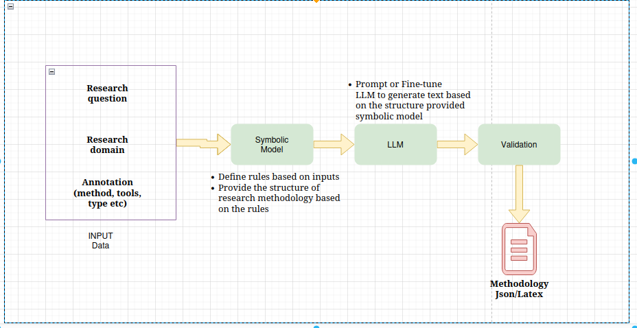

# Copilot: Research Methodology
This project aims to assist researchers in scientific writing by helping them draft the methodology section of their articles. The methodology is generated based on inputs provided by the researcher, such as the research question, research domain, and annotations (e.g., tools, methods, research type, etc.).

By leveraging the power of advanced LLMs like GPT-4 and Mistral, our goal is to develop an intelligent assistant to support researchers in this process.

## Process
This image present How our process is done.



## Run Project locally on your computer device

### Dependancies
to install all dependacies for the project run this command:
```sh
pip install -r requirements.txt

```